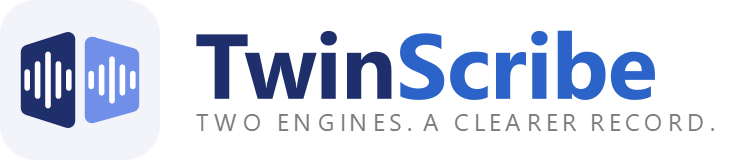
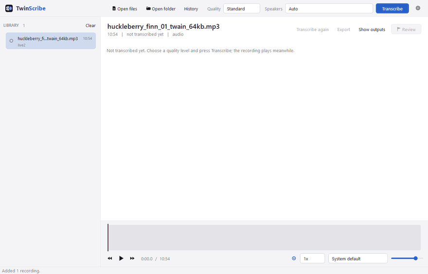
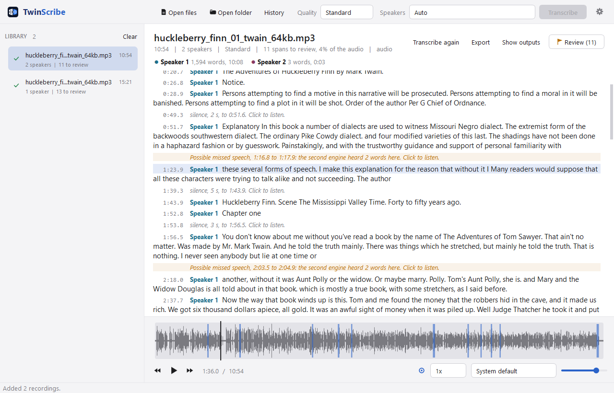
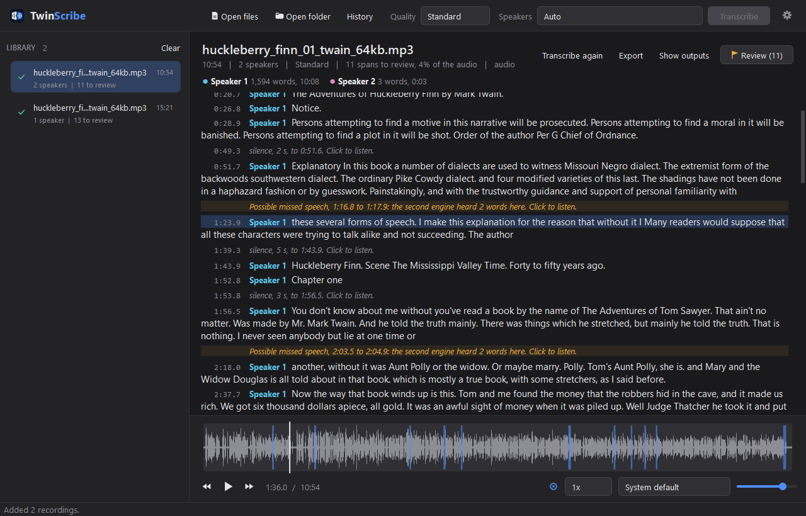
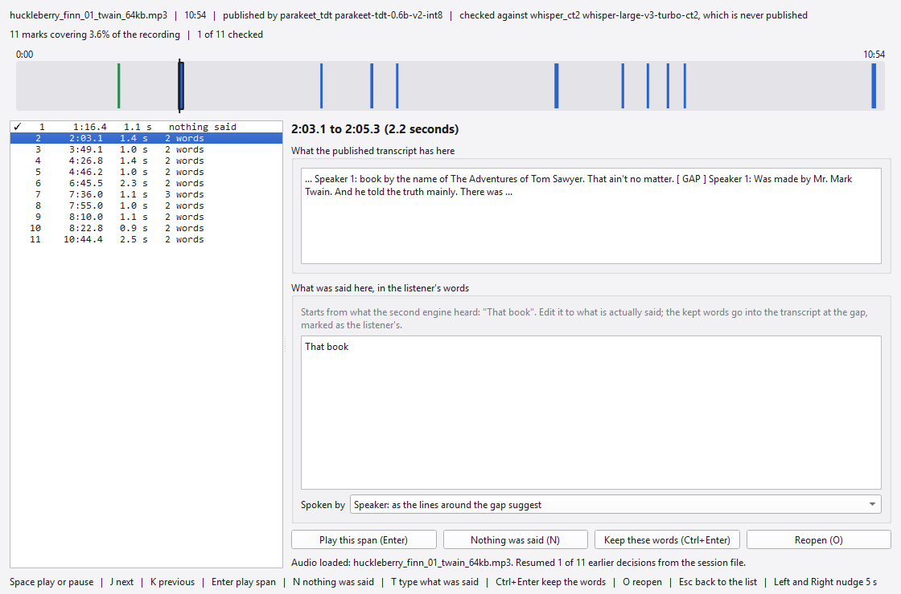
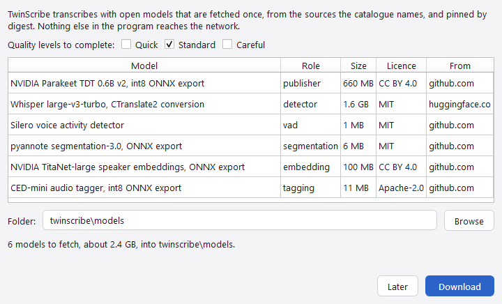

# TwinScribe

<picture>
  <source media="(prefers-color-scheme: dark)" srcset="docs/images/logo-dark.png">
  
</picture>

[](https://github.com/Unified-Source/TwinScribe/actions/workflows/tests.yml)

Windows build: [`twinscribe-win64.zip` on the Releases page](https://github.com/Unified-Source/TwinScribe/releases); the models are fetched on first start.

Offline transcription with speaker labels for long recordings, built for material that
will be relied on.

**Status: early. The design is measured; the implementation is built from it, runs end to end
with the live engines, and its bench reproduces the design's accuracy tables on the public
corpora (`docs/specs/bench.notes.md`). The first throughput figures are recorded there too;
speed is a property of the machine and is not quoted here.**

## What it is for

Take audio and video recordings on an ordinary laptop, with no network connection and no
administrator rights, and produce a timestamped, speaker-labelled transcript in plain text
and in Word, together with a record of how it was produced. The two workloads that shape
every decision are batches of twenty-minute two-party telephone recordings at narrowband
quality, and older interview-room video with one far-field microphone and several speakers.

The output will be read by people who were not present, so the governing rule is that a
transcript is a draft until it has been verified against the recording. The tool's job is to
make that verification targeted and cheap rather than a read-through.

## The design in one paragraph

Open transcription engines come in two families and they fail in opposite directions. The
Whisper family predicts each word partly from the words it has already written, so it always
produces something, and on hard or silent audio it can write fluent text that was never said.
Transducer engines such as NVIDIA Parakeet can only emit a word while consuming audio, so
they cannot write into silence, and their failure is the opposite: on hard audio they produce
nothing. twinscribe runs both. It publishes only the transducer's transcript, and it uses the
Whisper engine for one purpose, never shown to anybody: to mark every span where it heard
speech and the published engine heard nothing. Those marks are the review list, and on public
telephone recordings they landed on real missed speech 61 times out of 62, covering 92 per
cent of the words the published engine had dropped, for 18 per cent of the audio listened to.

The full design, the measurements on public corpora, the engine and licence landscape, and
the engineering traps already paid for are in
[docs/Design_and_Findings_2026-09-06.md](docs/Design_and_Findings_2026-09-06.md).

## What it produces, per recording

Beside the recording, named by its stem:

- `.docx` and `.txt`: timestamped, speaker-labelled, with a speaker summary at the top giving
  the word count assigned to each speaker, because a participant can vanish from a transcript
  while the overall accuracy looks normal; stretches of silence, music and background noise
  are marked where nothing is said, so a gap in the text is explained rather than filled;
- `.srt`: a subtitle file, so the transcript plays against the recording line by line in any
  player, with `[music]` and `[background noise]` cues where nothing is said;
- `.review.json`: the review list, with a screen for working through it with the audio at
  each mark;
- `.run.json`: the run record: engines and versions, settings, the file's digest, when it ran,
  how long it took, and any failure and why;
- `.transcript.json`: the document the application reads back and every renderer works from.

## The application

One window, in the manner of a media player: drop recordings or folders in, each plays at
once, and the ones that have been transcribed show their transcript following the audio, the
review marks on the timeline and between the lines, and a button that opens the verification
screen. Choose a quality level, press Transcribe, and the pipeline runs over everything not
yet done with progress per file. While a recording is being transcribed its lines appear as
they are decoded; they can be read without being pulled to the newest line, clicked to move
the playhead, and played from. The number of speakers can be given when it is known; by
default the count comes from clustering, so a speaker the models cannot separate is missing
from the labels, where the word counts show it, rather than hidden inside another. The one
thing in the package that reaches the network is the fetch of the models, and it runs only when
asked: the Get models dialog the window offers while no quality level is complete, or the
`fetch-models` command.

```
python -m twinscribe app [recordings or folders]
python -m twinscribe run <recordings or folders> [--quality standard] [--out FOLDER] [--device auto] [--speakers N]
python -m twinscribe check [--verify]
python -m twinscribe fetch-models [--level standard careful] [--root FOLDER]
python -m twinscribe export <transcript.json>
python -m twinscribe verify <review.json>
```

In a checkout with the project's virtual environment beside it, `twinscribe.cmd` runs the same
command line (`twinscribe.cmd run <folder>` transcribes with progress in the console; with no
arguments it opens the window), and `twinscribe-app.cmd` opens the window without a console.
A window started without a console writes anything it would have printed, and any unhandled
error, to `twinscribe.log` under the application home.

Models live in one folder (`TWINSCRIBE_MODELS`, or `models` beside the package);
`tools/fetch_models.py` fetches them from the sources the catalogue names and pins their
digests. A folder that runs with nothing installed is described in
[docs/Portable_Layout.md](docs/Portable_Layout.md). Which platforms and accelerators are
covered, and how the machine is probed for the best available option, is in
[docs/Platforms.md](docs/Platforms.md). Specifications and the notes recorded while building
from them are under `docs/specs/`.

## Seen in use

The recordings in these pictures are the first two chapters of a public-domain audiobook,
*The Adventures of Huckleberry Finn*, read for LibriVox: one reader, 10 min 54 s and
15 min 22 s, mono MP3 at 22 kHz as downloaded. They were dropped into the window as they came;
nothing was converted by hand.



*Transcribing* (23 seconds of a real run; the same clip as an [MP4](docs/media/live-transcribe.mp4)). The library on the left holds every recording added, with its state. The
selected recording shows its job card while it runs: the stage strip (reading the file,
loading both engines, transcribing and checking at the same time, marking silence and noise,
labelling speakers, writing the outputs), the elapsed time and the time left, a heartbeat,
and the published engine's lines as they are decoded. The list follows the newest line only
while the reader is at the bottom; a click seeks the player to that line and a double-click
plays it. The status line names the quality level and where each engine is running.



*Reading with the audio.* Once a recording has been transcribed its transcript follows the
playhead: the line under the playhead is highlighted and kept in view, the waveform timeline
carries every review mark, and the chips at the top give each speaker's share in words and
seconds (one reader here, so one chip). Space plays or pauses, J and K move between marks,
the arrows nudge by five seconds. The outputs sit beside the recording: the text and Word
transcripts, the subtitle file, the review list, the run record and the transcript document.



*The dark palette*, chosen in Settings, with the second chapter playing. The two chapters here
took 129 s and 199 s at the Standard level on a desktop with an NVIDIA device; the transducer
and the speaker models ran on the processor.



*Verifying.* The Review button opens the verification screen for the recording's review list:
a bar of the whole recording with every mark on it, the list of marks, the published
transcript either side of each gap, and what the second engine heard there as a hint of what
to listen for. Three actions per mark: play the span, nothing was said, type what was said (the prompt starts
from what the second engine heard, to be edited to what was actually said). A session file
records every resolution, and Apply to transcript puts the typed words into the transcript as
the listener's, marked "heard on review" in the text, the Word document and the window, and
writes the outputs again; the engine's words are never altered.

To do the same: fetch the models once, open the window on a folder, press Transcribe.

```
python -m twinscribe fetch-models
python -m twinscribe app <folder with the recordings>
```

## Installing

Three ways, from the least effort to the most. All three run offline once the models are in
place; none needs administrator rights.

1. **The executables** (Windows): download `twinscribe-win64.zip` from the
   [Releases](https://github.com/Unified-Source/TwinScribe/releases) page, unzip it and double-click
   `twinscribe\twinscribe-app.exe`; `twinscribe\twinscribe.exe` is the command line. The
   folder carries every library and the decoder. On first start the window offers to fetch the
   models of the Standard level (about 2.4 GB) from the sources the catalogue names into a
   `models` folder beside the executables; `twinscribe.exe fetch-models` does the same from the
   command line, and a fetched `models` folder can instead be put beside the executables, named
   by `TWINSCRIBE_MODELS`, or chosen in Settings. A `home` folder beside them makes the copy
   portable. The executables are not signed, so Windows may warn that they come from an unknown
   publisher. `tools/build_exe.py` builds the folder with PyInstaller from `tools/twinscribe.spec`.
2. **The portable folder** (Windows): assembled from a checkout by `tools/build_portable.py`, as
   described in [docs/Portable_Layout.md](docs/Portable_Layout.md), because it carries the models
   and is larger than a release asset may be. Unzip it anywhere and double-click
   `twinscribe-app.cmd`. The folder holds its own interpreter, every library, the decoder, the
   models of the Standard level and a `home` folder for settings and records, so nothing is
   installed and two copies never share state. `twinscribe.cmd run <folder>` is the command
   line.
3. **From source** (Windows, Linux, macOS): Python 3.11 or later, then

   ```
   pip install .[engines,app,ffmpeg]        # add ,cuda on Windows or Linux with an NVIDIA device
   python -m twinscribe fetch-models        # or let the window offer it on first start
   python -m twinscribe app
   ```



The models are fetched once, by the window's Get models dialog, by `python -m twinscribe
fetch-models` or by `tools/fetch_models.py`, from the sources the catalogue names, and pinned by
digest; `python -m twinscribe check --verify` confirms a store. Which platforms and accelerators
are covered is in [docs/Platforms.md](docs/Platforms.md).

## Components and licences

Engines and models are open and run on the processor: faster-whisper and CTranslate2 (MIT),
Whisper weights (MIT), sherpa-onnx (Apache-2.0), NVIDIA Parakeet TDT 0.6B v2 and TitaNet
(CC BY 4.0), Silero VAD (MIT), pyannote segmentation-3.0 (MIT), the CED audio tagger
(Apache-2.0) with the AudioSet class labels (CC BY 4.0). The interface is PySide6
(LGPL-3.0). Attributions are in [NOTICE](NOTICE). Test material is public research audio
under CC BY 4.0; no private recording of any kind is used in development or testing.

## Licence

Apache License 2.0. See [LICENSE](LICENSE).

Copyright 2026 Uniflux Technology Inc.
